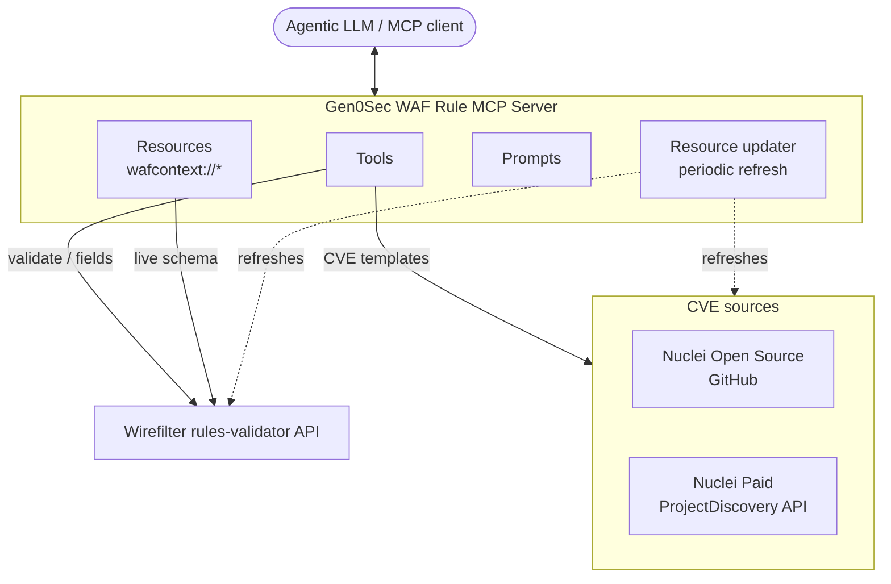

<p align="center">
  
</p>

<p align="center">
  <a href="https://github.com/gen0sec/mcp-server/blob/main/pyproject.toml"></a> &nbsp;
  <a href="https://github.com/gen0sec/mcp-server/releases"></a> &nbsp;
   &nbsp;
  <a href="https://docs.gen0sec.com/"></a> &nbsp;
  <a href="https://discord.gg/jzsW5Q6s9q"></a> &nbsp;
  <a href="https://x.com/gen0sec"></a>
</p>

<p align="center">
  <a href="https://discord.gg/jzsW5Q6s9q"></a>
  <a href="https://arxignis.substack.com/"></a>
</p>

---

## WAF & Smart-Firewall Rule Generation for Agentic LLMs

An **MCP server** that lets an LLM author, validate, and test [Wirefilter](https://github.com/cloudflare/wirefilter) WAF and Smart Firewall rules — grounded in live schema and real CVE exploit templates instead of guesswork.

**What it does:**
- **Validates rules against a real engine** — expressions are checked (and optionally test-matched) through the Wirefilter rules-validator API, so the model gets real pass/fail feedback, not a hallucinated opinion
- **Grounds generation in live schema** — serves the authoritative actions / expressions / fields / functions / operators / values straight from the rules-validator, so rules use fields that actually exist
- **Pulls real exploit context** — fetches CVE-indexed Nuclei templates from multiple sources (Nuclei Open Source via GitHub, Nuclei Paid via the ProjectDiscovery API) to inform CVE-driven rule generation
- **Self-updating** — periodically refreshes the Wirefilter context and CVE template repositories in the background

> Runs anywhere Python 3.12+ runs · ships as a Claude Desktop bundle, a stdio MCP server, or an HTTP container

---

## Quick start

### Claude Desktop (bundle)

```bash
# Prerequisites: uv, and mcpb (npm install -g @anthropic-ai/mcpb)
mcpb pack          # produces gen0sec-mcp-server.mcpb
```

Open the generated `gen0sec-mcp-server.mcpb` file — Claude Desktop installs it in about a minute, after which the tools, resources, and prompts are available.

### Cursor IDE — local (stdio)

Add to `~/.cursor/mcp.json` (`%USERPROFILE%\.cursor\mcp.json` on Windows):

```json
{
  "mcpServers": {
    "waf-rule-mcp": {
      "command": "uv",
      "args": [
        "run",
        "--project", "/absolute/path/to/mcp-server",
        "/absolute/path/to/mcp-server/server/main.py"
      ],
      "env": {
        "WAF_VALIDATION_API_URL": "https://public.gen0sec.com/v1/waf/validate"
      }
    }
  }
}
```

`WAF_VALIDATION_API_URL` is optional — if unset, the value from `server/config.yaml` is used. Restart Cursor to apply.

### Docker (HTTP)

```bash
docker build -t waf-rule-mcp .
docker run -p 8000:8000 waf-rule-mcp
```

Then point your MCP client at it:

```json
{
  "mcpServers": {
    "waf-rule-mcp": { "url": "http://localhost:8000" }
  }
}
```

> The WAF rule validation API must be reachable for the validation tools to work. Set its URL via `WAF_VALIDATION_API_URL` or `server/config.yaml`.

---

## MCP surface

### Tools

| Tool | Purpose |
|---|---|
| `fetch_cve_vulnerability_template` | Retrieve a CVE-indexed vulnerability template from a preferred source (Nuclei Open Source or Nuclei Paid API) |
| `fetch_cve_from_all_sources` | Fetch a CVE template from **all** enabled sources for cross-source comparison |
| `list_cve_sources` | List the registered CVE source plugins and their status |
| `validate_waf_expression` | Validate a Wirefilter rule expression (`rule_type` selects the scheme) |
| `validate_waf_expression_with_tests` | Validate a Wirefilter rule and match it against test data (mock data if none given) |
| `get_waf_context` | Fetch WAF context from Wirefilter docs: actions, expressions, fields, functions, operators, values |
| `get_rule_fields` | Fetch the live, authoritative Wirefilter field/function schema directly from the rules-validator |

### Resources

| URI | Reference |
|---|---|
| `wafcontext://actions` | Actions available in the Rules language |
| `wafcontext://expressions` | Expressions available in the Rules language |
| `wafcontext://fields` | Fields available in the Rules language |
| `wafcontext://functions` | Functions available in the Rules language |
| `wafcontext://operators` | Operators available in the Rules language |
| `wafcontext://values` | Values available in the Rules language |

### Prompts

| Prompt | Generates a rule from… |
|---|---|
| `natural_waf_rule_generation_prompt` | a natural-language description |
| `cve_waf_rule_generation_prompt` | a CVE index |
| `smart_firewall_rule_generation_prompt` | a natural-language description, as an L3/L4 + JA4 Smart Firewall rule (no `http.*` fields; `block`/`allow` actions) |

---

## Architecture



---

## Documentation

| | |
|---|---|
| [Gen0Sec Docs](https://docs.gen0sec.com/) | Product documentation and guides |
| [`server/config.yaml`](server/config.yaml) | Validation API URL, CVE source toggles, update intervals |
| [`manifest.json`](manifest.json) | Claude Desktop bundle manifest and user-configurable options |
| [Wirefilter](https://github.com/cloudflare/wirefilter) | The rule expression language this server targets |

---

## Thank you!

- [Cloudflare](https://github.com/cloudflare) for Wirefilter
- [ProjectDiscovery](https://github.com/projectdiscovery/nuclei-templates) for the Nuclei templates
